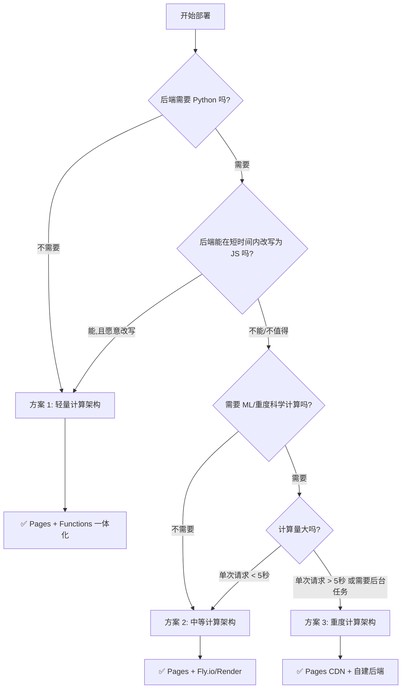
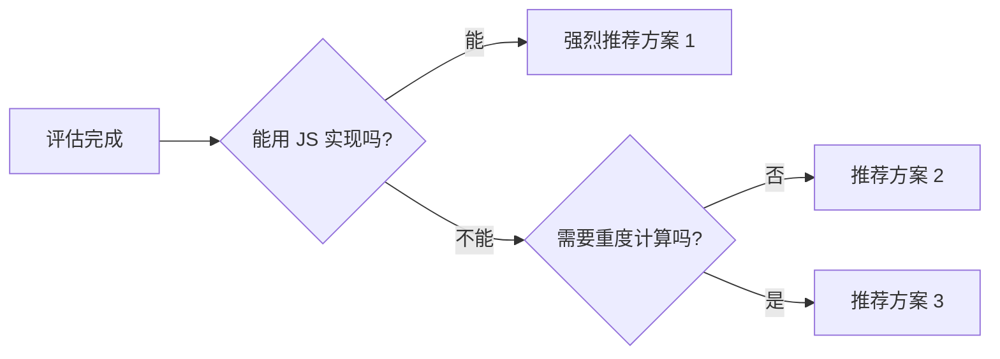

# Cloudflare 部署架构选型指南

> **目标受众**：AI 助手在协助用户部署全栈应用到 Cloudflare 时使用  
> **文档目的**：根据后端计算复杂度，快速选择最优部署架构  
> **最后更新**：2026-02-17

> ⚠️ **本文档不推荐 Cloudflare Workers Python（Beta）**，其包兼容性差、限制多，详见"常见错误 3"。如需 Python 后端，请使用方案 2 或方案 3。

---

## 📋 快速决策流程



---

## 🎯 三大架构方案对比

| 维度 | 方案 1: 轻量计算 | 方案 2: 中等计算 | 方案 3: 重度计算 |
|------|----------------|----------------|----------------|
| **适用场景** | 纯 JS 或简单计算 | 需要 Python 但不复杂 | 科学计算/ML 推理 |
| **技术栈** | React + JS/TS | React + Python (FastAPI) | React + 完整后端 |
| **Cloudflare 服务** | Pages + Functions | Pages (仅前端) | Pages (仅前端) |
| **后端位置** | Cloudflare Functions | Fly.io/Render 等 | VPS/云服务器 |
| **部署复杂度** | ⭐ 极简 | ⭐⭐ 简单 | ⭐⭐⭐⭐ 复杂 |
| **维护成本** | ⭐ 极低 | ⭐⭐ 低 | ⭐⭐⭐⭐ 高 |
| **免费额度** | ✅ 完全免费 | ✅ 免费 (有限制) | ❌ 通常需付费 |
| **性能** | ⭐⭐⭐⭐⭐ 全球 CDN | ⭐⭐⭐⭐ 区域性 | ⭐⭐⭐ 取决于服务器 |
| **扩展性** | ⭐⭐⭐ 有限制 | ⭐⭐⭐⭐ 良好 | ⭐⭐⭐⭐⭐ 无限制 |

---

## 方案 1: 轻量计算架构（⭐⭐⭐⭐⭐ 推荐）

### 📦 架构图

```
用户
 │
 ▼
┌─────────────────────────────────┐
│   Cloudflare Pages              │
│                                 │
│   ┌─────────┐   ┌────────────┐  │
│   │ 前端 SPA │   │  Functions │  │
│   │ (React) │──▶│  (JS/TS)   │  │
│   └─────────┘   └──────┬─────┘  │
│                        │        │
│                 ┌──────┴─────┐  │
│                 │  D1 + R2   │  │
│                 └────────────┘  │
└─────────────────────────────────┘

一个项目 · 一条命令部署 · 完全免费
```

### ✅ 适用条件（满足任一即可）

- [ ] **后端逻辑可以用 JavaScript/TypeScript 实现**
- [ ] **计算逻辑简单**（如数学运算、数据聚合、API 转发）
- [ ] **没有特定 Python 库依赖**（或依赖可用 JS 库替代）
- [ ] **追求极致简洁的部署流程**

### 🏗️ 项目结构

```
my-app/
├── dist/                    # Vite 构建输出（前端）
├── functions/               # Cloudflare Pages Functions
│   └── api/
│       ├── users.ts         # GET /api/users
│       ├── calculate.ts     # POST /api/calculate
│       └── storage/
│           └── upload.ts    # POST /api/storage/upload
├── src/                     # 前端源码
│   ├── App.tsx
│   └── components/
├── wrangler.toml            # Cloudflare 配置
├── package.json
└── vite.config.ts
```

### 📝 配置文件示例

#### `wrangler.toml`

```toml
name = "my-app"
compatibility_date = "2026-02-11"
pages_build_output_dir = "dist"

# 绑定 D1 数据库（可选）
[[d1_databases]]
binding = "DB"
database_name = "my-app-db"
database_id = "你的数据库ID"

# 绑定 R2 存储（可选）
[[r2_buckets]]
binding = "R2"
bucket_name = "my-app-storage"

# 环境变量在 Cloudflare Dashboard 中设置
# Pages → Settings → Environment variables
```

#### `package.json`

```json
{
  "name": "my-app",
  "scripts": {
    "dev": "vite",
    "build": "vite build",
    "deploy": "npm run build && wrangler pages deploy dist --project-name=my-app"
  },
  "dependencies": {
    "react": "^19.2.0",
    "react-dom": "^19.2.0"
  },
  "devDependencies": {
    "vite": "^6.2.0",
    "wrangler": "^4.50.0"
  }
}
```

### 🚀 部署步骤

#### 第一次部署

```bash
# 1. 登录 Cloudflare（首次使用）
npx wrangler login

# 2. 创建 Pages 项目（首次需要）
npx wrangler pages project create my-app

# 3. 创建 D1 数据库（如果需要）
npx wrangler d1 create my-app-db
# 将返回的 database_id 添加到 wrangler.toml

# 4. 创建 R2 存储桶（如果需要）
npx wrangler r2 bucket create my-app-storage

# 5. 部署
npm run deploy
```

#### 日常部署

```bash
npm run deploy
```

**就这么简单！一条命令完成前端 + 后端部署。**

### 💡 Function 编写示例

#### 类型定义（推荐放在 `functions/env.d.ts`）

```typescript
interface Env {
  DB: D1Database;
  R2: R2Bucket;
}
```

#### 简单 API：`functions/api/hello.ts`

```typescript
export const onRequest: PagesFunction<Env> = async (context) => {
  return Response.json({ message: "Hello World" });
};
```

#### 使用 D1 数据库：`functions/api/users.ts`

```typescript
export const onRequestGet: PagesFunction<Env> = async (context) => {
  const { results } = await context.env.DB.prepare(
    "SELECT * FROM users LIMIT 10"
  ).all();
  return Response.json(results);
};
```

#### 使用 R2 存储：`functions/api/upload.ts`

```typescript
export const onRequestPost: PagesFunction<Env> = async (context) => {
  const file = await context.request.formData();
  await context.env.R2.put("uploads/file.txt", file.get("file"));
  return Response.json({ success: true });
};
```

### ⚠️ 限制和注意事项

| 限制项 | 免费版 | 付费版 ($5/月) |
|-------|--------|--------------|
| 请求数 | 100,000/天 | 10,000,000/月 |
| CPU 时间 | 10ms/请求 | 50ms/请求 |
| 内存 | 128MB | 128MB |
| 执行时间 | 无硬限制（受 CPU 影响） | 无硬限制 |

> **关键建议**：
> - ✅ 适合大多数 CRUD、计算、API 转发场景
> - ⚠️ 如果单次请求计算超过 10ms CPU，考虑升级付费版或拆分计算
> - ❌ 不适合长时间任务（如视频转码、大批量数据处理）
> - ❌ 不适合需要 SSR 的框架（Next.js/Nuxt），SSR 需使用 Cloudflare Workers 或方案 2/3

---

## 方案 2: 中等计算架构（⭐⭐⭐⭐）

### 📦 架构图

```
用户
 │
 ▼
┌─────────────────────┐
│ Cloudflare Pages    │  ← CDN 加速前端
│ (仅前端静态文件)     │
└──────────┬──────────┘
           │ API 请求
           ▼
┌─────────────────────┐
│ Fly.io / Render     │  ← 完整 Python 后端
│                     │
│  FastAPI + 完整依赖  │
│  (NumPy/Pandas等)   │
│                     │
│  PostgreSQL (可选)  │
└─────────────────────┘

前端免费 · 后端低成本 · 分部署
```

### ✅ 适用条件（同时满足）

- [x] **必须使用 Python** 且逻辑较复杂，不值得重写为 JS
- [x] **需要 NumPy、Pandas 等科学计算库**（但不是重度使用）
- [x] **计算量适中**（单次请求 < 5 秒）
- [x] **希望尽量使用免费资源**

### 🏗️ 项目结构

```
my-app/
├── frontend/                # 前端项目
│   ├── dist/               # 构建输出
│   ├── src/
│   ├── package.json
│   ├── vite.config.ts
│   └── wrangler.toml
│
└── backend/                # Python 后端
    ├── main.py             # FastAPI 入口
    ├── requirements.txt
    ├── Procfile            # Railway 配置
    └── railway.toml        # Railway 或 fly.toml
```

### 📝 后端配置示例

#### `backend/main.py`

```python
from fastapi import FastAPI
from fastapi.middleware.cors import CORSMiddleware
import pandas as pd
import numpy as np

app = FastAPI()

# CORS 配置（允许 Cloudflare Pages 域名）
app.add_middleware(
    CORSMiddleware,
    allow_origins=[
        "https://my-app.pages.dev",
        "https://my-custom-domain.com"
    ],
    allow_methods=["*"],
    allow_headers=["*"],
)

@app.post("/api/calculate")
async def calculate(data: dict):
    # 使用 NumPy/Pandas 进行计算
    arr = np.array(data["values"])
    result = arr.mean()
    return {"result": float(result)}

@app.get("/health")
async def health():
    return {"status": "ok"}
```

#### `backend/requirements.txt`

```
fastapi==0.115.0
uvicorn[standard]==0.32.1
pandas==2.2.3
numpy==2.2.1
```

#### Railway 部署配置 `railway.toml`（付费，$5/月起）

```toml
[build]
builder = "NIXPACKS"

[deploy]
startCommand = "uvicorn main:app --host 0.0.0.0 --port $PORT"
healthcheckPath = "/health"
```

#### Fly.io 部署配置 `fly.toml`（推荐，有免费额度）

```toml
app = "my-app-backend"
primary_region = "nrt"  # 东京，按需选择

[build]
  builder = "paketobuildpacks/builder:base"

[http_service]
  internal_port = 8000
  force_https = true

[checks]
  [checks.health]
    port = 8000
    type = "http"
    interval = "15s"
    timeout = "2s"
    path = "/health"
```

### 🚀 部署步骤

#### 1. 部署后端到 Fly.io（推荐，有免费额度）

```bash
# 安装 Fly CLI
curl -L https://fly.io/install.sh | sh

# 登录
fly auth login

# 在 backend/ 目录启动项目
cd backend
fly launch

# 设置环境变量
fly secrets set GEMINI_API_KEY=your-key

# 部署
fly deploy
```

> 也可使用 Render（免费但有 15 分钟自动休眠）或 Railway（$5/月起，无免费层）。

#### 2. 配置前端 API 地址

在 `frontend/.env.local`:

```bash
VITE_BACKEND_BASE_URL=https://my-app-backend.fly.dev
```

#### 3. 部署前端到 Cloudflare Pages

```bash
cd frontend
npm run build
npx wrangler pages deploy dist --project-name=my-app
```

### 💰 平台对比（价格以官网为准）

| 平台 | 免费额度 | 限制 | 适用场景 |
|------|---------|------|---------|
| **Fly.io** | 3 个共享 CPU VM | 256MB RAM/VM | 推荐，免费额度稳定 |
| **Render** | 750 小时/月 | 15 分钟无请求自动休眠，首次唤醒慢 | 备选，接受冷启动延迟 |
| **Railway** | 试用期 $5 额度，之后无免费额度 | $5/月起（Hobby），需绑卡 | 付费用户推荐 |

> **推荐顺序**：Fly.io（免费）> Render（免费但有休眠）> Railway（付费）

### ⚠️ 注意事项

- **CORS 配置**：后端必须允许前端域名跨域访问
- **冷启动**：免费服务可能有冷启动延迟（首次请求 5-30 秒）
- **健康检查**：添加 `/health` 端点，防止自动休眠
- **环境变量**：敏感信息（API Key）在平台 Dashboard 设置

---

## 方案 3: 重度计算架构（⭐⭐⭐）

### 📦 架构图

```
用户
 │
 ▼
┌─────────────────────┐
│ Cloudflare Pages    │  ← CDN 加速前端
│ (仅前端静态文件)     │
└──────────┬──────────┘
           │ API 请求
           ▼
┌─────────────────────┐
│ 自建后端服务器       │  ← VPS/云服务器
│                     │
│  FastAPI / Django   │
│  NumPy / Pandas     │
│  TensorFlow / PyTorch│
│  PostgreSQL / Redis │
│  Celery / RabbitMQ  │
└─────────────────────┘

前端免费 · 后端自建 · 完全控制
```

### ✅ 适用条件（满足任一即可）

- [x] **需要机器学习推理**（TensorFlow、PyTorch 等）
- [x] **需要大规模数据处理**（GB 级数据集）
- [x] **需要长时间任务**（超过 30 秒）
- [x] **需要后台任务队列**（Celery、Redis 等）
- [x] **需要自定义数据库配置**（PostgreSQL、MongoDB 等）

### 🏗️ 推荐云服务商

| 服务商 | 最低配置 | 价格 | 适用 |
|--------|---------|------|------|
| **Hetzner** | 2vCPU/4GB | €4.5/月 (~$5) | 性价比最高 |
| **DigitalOcean** | 1vCPU/1GB | $6/月 | 简单易用 |
| **AWS Lightsail** | 1vCPU/1GB | $5/月 | AWS 生态 |
| **Tencent Cloud** | 2vCPU/2GB | ¥40/月 (~$6) | 国内用户 |

### 🚀 部署步骤（推荐 Docker 方式）

#### 1. 创建服务器

```bash
# 选择操作系统：Ubuntu 24.04 LTS
# 选择配置：Basic Plan - $5-6/月
# 选择地区：按用户分布选择
```

#### 2. Docker 部署（推荐）

准备 `Dockerfile`：

```dockerfile
FROM python:3.11-slim
WORKDIR /app
COPY requirements.txt .
RUN pip install --no-cache-dir -r requirements.txt
COPY . .
CMD ["uvicorn", "main:app", "--host", "0.0.0.0", "--port", "8000"]
```

准备 `docker-compose.yml`：

```yaml
services:
  backend:
    build: .
    ports:
      - "8000:8000"
    environment:
      - GEMINI_API_KEY=${GEMINI_API_KEY}
    restart: unless-stopped
```

在服务器上部署：

```bash
# SSH 连接服务器
ssh root@your-server-ip

# 安装 Docker
curl -fsSL https://get.docker.com | sh

# 克隆项目并启动
git clone https://github.com/your-repo.git /var/www/backend
cd /var/www/backend
docker compose up -d
```

#### 3. 配置 Nginx 反向代理 + SSL

创建 `/etc/nginx/sites-available/backend`:

```nginx
server {
    listen 80;
    server_name api.yourdomain.com;

    location / {
        proxy_pass http://127.0.0.1:8000;
        proxy_set_header Host $host;
        proxy_set_header X-Real-IP $remote_addr;
    }
}
```

启用配置并配置 SSL：

```bash
apt install nginx certbot python3-certbot-nginx -y
ln -s /etc/nginx/sites-available/backend /etc/nginx/sites-enabled/
nginx -t && systemctl restart nginx
certbot --nginx -d api.yourdomain.com
```

#### 4. 部署前端到 Cloudflare Pages

```bash
# 在 frontend/.env.local 配置后端地址
echo "VITE_BACKEND_BASE_URL=https://api.yourdomain.com" > .env.local

# 部署
npm run deploy
```

### ⚠️ 运维要点

- **监控**：安装 Prometheus + Grafana 监控服务器状态
- **日志**：使用 `docker compose logs -f` 查看日志
- **备份**：定期备份数据库（cron + pg_dump）
- **安全**：配置防火墙（ufw），禁用 root SSH 登录
- **更新**：`git pull && docker compose up -d --build`

---

## 🔧 AI 助手指导要点

### 当用户询问"如何部署到 Cloudflare"时

**第一步：评估计算复杂度**

询问用户：

1. ❓ 后端使用什么语言？（Python / Node.js / Go / 其他）
2. ❓ 是否使用了特定 Python 库？（NumPy / Pandas / TensorFlow 等）
3. ❓ 单次请求的计算时间大概多久？（< 1 秒 / 1-5 秒 / > 5 秒）
4. ❓ 是否有长时间后台任务？（视频处理 / 大数据分析 等）

**第二步：推荐方案**

根据评估结果，按以下优先级推荐：



**第三步：提供具体步骤**

- 使用本文档中的**完整代码示例**
- 强调**关键配置项**（wrangler.toml、CORS、环境变量）
- 提醒**免费额度限制**
- 提供**故障排查清单**

### 常见错误和解决方案

#### 错误 1：CORS 跨域问题

**现象**：前端请求后端返回 CORS error

**解决**：

```python
# 在 FastAPI 后端添加
from fastapi.middleware.cors import CORSMiddleware

app.add_middleware(
    CORSMiddleware,
    allow_origins=["https://your-frontend.pages.dev"],  # ← 改成你的前端域名
    allow_methods=["*"],
    allow_headers=["*"],
)
```

#### 错误 2：Environment variables 未生效

**现象**：代码中读取环境变量为 undefined

**解决**：

1. 检查 Cloudflare Dashboard → Pages → Settings → Environment variables
2. 确保变量名与代码一致（区分大小写）
3. **重新部署**（环境变量修改后需重新部署才生效）

#### 错误 3：Python Workers 包不兼容

**现象**：部署时报错 "Package not supported"

**解决**：

- ❌ **不要使用 Python Workers**
- ✅ **改用方案 2**（Fly.io/Render）或方案 3（自建）

---

## 📚 快速参考卡

| 我的后端是... | 推荐方案 | 关键命令 |
|-------------|---------|---------|
| **纯前端 + API 调用** | 方案 1 | `npm run deploy` |
| **Node.js + Express** | 方案 1（改写为 Functions） | `npm run deploy` |
| **Python + FastAPI（简单）** | 方案 1（如愿意改写为 JS）或方案 2 | `npm run deploy` 或 `fly deploy` |
| **Python + NumPy/Pandas** | 方案 2 | `fly deploy` + `wrangler pages deploy` |
| **Python + ML 模型** | 方案 3 | 自建服务器 |
| **Go / Rust / Java** | 方案 2 或 3 | 取决于复杂度 |

---

## 🔗 延伸阅读

- [Cloudflare Pages 官方文档](https://developers.cloudflare.com/pages/)
- [Cloudflare Functions 文档](https://developers.cloudflare.com/pages/functions/)
- [Fly.io 快速开始](https://fly.io/docs/speedrun/)
- [Render 部署指南](https://docs.render.com/deploy-fastapi)

---

**最后提醒**：

> 对于**纯前端或后端可用 JS 实现的应用**，方案 1（Pages Functions 一体化）是最优选择。
> 对于**必须使用 Python 的应用**，方案 2（Pages + Fly.io/Render）是性价比最高的方案。
> 优先考虑简单方案，只有在遇到明确限制时才升级到更复杂架构。
